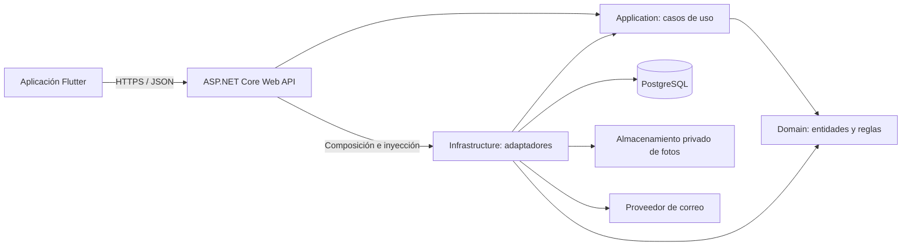
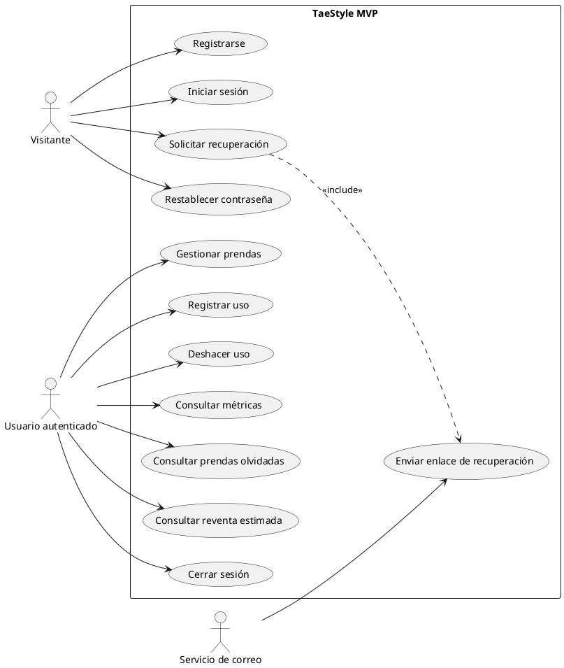
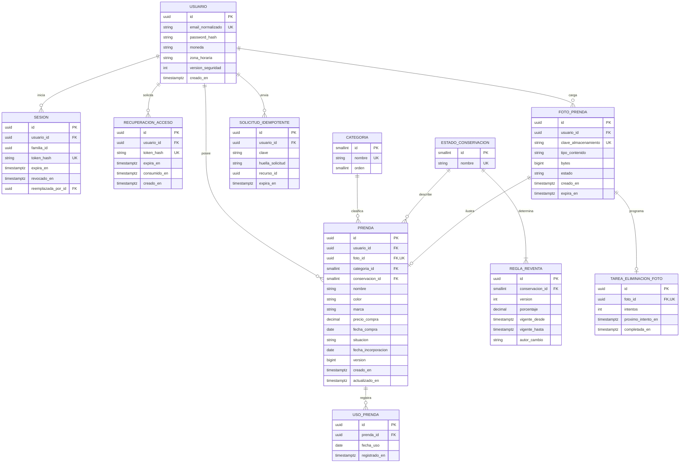

# TaeStyle — Diseño funcional y técnico del MVP

Versión 1.2 · 5 de octubre de 2026 · .NET 10 LTS y alcance del piloto aprobados; revisión de experiencia pendiente

Este documento reúne los ocho entregables de diseño. No contiene implementación, scripts SQL ni migraciones ejecutables. Las estructuras de carpetas y los diagramas son especificaciones del trabajo posterior. Las decisiones propuestas quedan identificadas para validarlas antes de implementar.

## 1. Documento de arquitectura

### 1.1 Producto y alcance

**Propuesta de valor:** «Te ayudamos a vestir mejor, comprar menos y recuperar dinero de la ropa que no usas».

El MVP hace visible qué ropa posee la persona, cuánto ha invertido, qué prendas utiliza y cuáles podría recuperar para su uso o considerar vender en el futuro. No recomienda combinaciones ni realiza ventas. El potencial de reventa es una estimación orientativa, no dinero recuperado ni una tasación de mercado.

Público principal: mujeres de 25 a 55 años con muchas prendas, compras frecuentes y dificultad para aprovechar su guardarropa. La interfaz debe ser clara, rápida y respetuosa: evitar mensajes que culpabilicen por no usar ropa o por su precio.

**Incluido:** cuentas, recuperación de contraseña, closet personal, foto por prenda, gestión de prendas, registro de uso, métricas, detección de prendas olvidadas y estimación de reventa configurable.

**Excluido:** marketplace, comunidad, probador virtual, IA estilista, redes sociales, tiendas, clima, calendario de outfits e intercambio de ropa. Tampoco se incorporan pagos, suscripciones, múltiples closets por persona ni sincronización sin conexión en este MVP.

Indicadores de producto propuestos: proporción de cuentas que registran su primera prenda, tiempo hasta esa primera prenda, usuarios que registran usos semanalmente y prendas olvidadas que vuelven a usarse. No se afirmará ahorro financiero real a partir de estas métricas.

### 1.2 Decisiones funcionales

El 5 de octubre de 2026 se confirmó el piloto en Ecuador con USD y Android primero. Se aprobaron precio y fecha de compra opcionales, máximo un uso diario por prenda, olvido desde último uso o incorporación cuando no hay usos, y archivo con conservación del historial y exclusión de métricas activas. Las demás especificaciones siguen como propuestas técnicas del diseño.

| Tema | Decisión para el MVP |
|---|---|
| Closet | Un closet implícito por usuario; no se necesita entidad Closet todavía. |
| Moneda | USD para todas las cuentas del piloto en Ecuador. Se conserva el campo moneda por cuenta para evolución futura; no hay conversión ni cambio de moneda en el MVP. |
| Zona horaria | Zona IANA por usuario; fechas de uso y compra son fechas de calendario. Auditoría y expiraciones se guardan en UTC. |
| Conservación | Excelente, Bueno o Regular; determina la regla de reventa. |
| Situación | Activa o Archivada. Una prenda archivada permanece consultable, pero no forma parte del closet activo. |
| Precio desconocido | Se permite nulo. Nunca se interpreta como cero. Un precio cero sí representa una prenda sin desembolso registrado. |
| Fecha de compra | Opcional: muchas personas no recuerdan la fecha exacta. Si se registra, no puede ser futura. |
| Foto | Una por prenda, obligatoria para completar el alta; cámara o galería. |
| Uso | Como máximo un registro por prenda y fecha. El botón registra hoy; se permite indicar una fecha anterior y deshacer errores. |
| Historial previo | Solo cuentan usos registrados. El costo por uso no pretende reconstruir toda la vida de la prenda. |
| Eliminación | Confirmación explícita. Borra prenda y usos relacionados; las métricas se recalculan. Archivar es la alternativa para conservar su historial. |
| Reglas de reventa | Globales, versionadas y administradas operativamente; no habrá pantalla de administración ni configuración individual en el MVP. |

### 1.3 Reglas de negocio y métricas

**Universo de cálculo:** las tarjetas principales consideran únicamente prendas activas del usuario autenticado. La pantalla muestra «Closet activo». El listado también permite consultar archivadas. Se presentan el total registrado, el total activo y el total archivado con etiquetas distintas.

| Métrica | Definición |
|---|---|
| Cantidad registrada | Prendas activas + archivadas, excluyendo eliminadas. |
| Prendas activas | Cantidad con situación Activa. No significa que hayan sido usadas recientemente. |
| Valor del closet activo | Suma de precios conocidos de prendas activas. Es inversión registrada, no valor actual de mercado. |
| Valor por categoría | Misma suma, agrupada por categoría. La suma de las categorías coincide con el total. |
| Prendas sin uso registrado | Prendas activas sin registros en UsoPrenda, aunque la persona pueda haberlas usado antes de instalar la app. |
| Costo por uso | Precio de compra / número de días de uso registrados de la prenda. Con cero usos se muestra «Aún sin usos»; con precio nulo, «Precio no registrado». |
| Reventa estimada | Precio conocido × porcentaje vigente para el estado de conservación. |
| Potencial total de reventa | Suma de estimaciones redondeadas de las prendas activas con precio; se ofrece también el subtotal de prendas olvidadas. |

Reglas adicionales:

- Mostrar siempre cobertura: por ejemplo, «Valor registrado: 420 USD · 18 de 24 prendas tienen precio».
- Si no hay prendas, el valor es cero y se invita a agregar la primera. Si hay prendas pero todas carecen de precio, se muestra «Sin precios registrados».
- Importes almacenados como decimales, nunca coma flotante. Propuesta inicial: monedas de dos decimales, redondeo comercial a dos decimales por estimación de prenda; el total suma esos importes.
- No promediar costos por uso de diferentes prendas ni calcular un supuesto ahorro sin un modelo adicional.
- Editar el precio, la conservación, la categoría o la situación cambia las métricas actuales. No hay informes históricos de valoración en este MVP.
- Porcentajes iniciales: Excelente 70 %, Bueno 50 %, Regular 30 %. Valores permitidos entre 0 y 100 %, con exactamente una regla vigente por estado.
- La respuesta de estimación incluye porcentaje y versión de regla. La interfaz indica: «Estimación orientativa; el precio real depende de la demanda y del estado de la prenda».

**Prendas olvidadas**

Si existen usos, la referencia es la última fecha de uso. Si nunca se registró un uso, la referencia es la fecha local de incorporación al closet, y se muestra «Sin uso registrado desde que la agregaste». No se infiere falta de uso desde la compra.

Los días se calculan entre la fecha de referencia y la fecha actual en la zona horaria de la cuenta. Los grupos son excluyentes:

| Días sin uso registrado | Grupo |
|---|---|
| 0–90 | Sin alerta |
| 91–180 | Más de 90 días |
| 181–365 | Más de 180 días |
| 366 o más | Más de 365 días |

Una prenda de 400 días aparece solo en el último grupo. Registrar un uso reciente actualiza inmediatamente su clasificación. Se calculan los grupos al consultar, sin un proceso nocturno obligatorio. La fecha de compra no inicia una alerta. El último uso anterior a la incorporación, si la persona lo registra, sí aporta evidencia real para calcularla.

Ejemplos de aceptación: prenda de 100 USD con cuatro usos → 25 USD por uso; en estado Bueno → 50 USD de reventa. A los 90 días no hay alerta; a los 91 sí. Una prenda nueva sin usos no aparece automáticamente como olvidada.

### 1.4 Arquitectura de la solución

Se propone un **monolito modular**, una API y una base PostgreSQL. Mantiene bajo el costo operativo y permite separar posteriormente módulos cuando exista una necesidad comprobada. Flutter se conecta exclusivamente a la API mediante HTTPS.



Las flechas entre capas indican dependencias de código. En ejecución, Application invoca interfaces que Infrastructure implementa. Domain no depende de EF Core, HTTP, Flutter, almacenamiento ni proveedores de IA.

| Capa | Responsabilidades |
|---|---|
| Domain | Prenda, UsoPrenda, valores de dinero, conservación y situación; invariantes y fórmulas deterministas. |
| Application | Commands, queries, handlers, DTOs, validación de entrada, autorización por propietario e interfaces de repositorios y servicios. |
| Infrastructure | DbContext, configuraciones EF, repositorios, consultas proyectadas, Identity, JWT, correo, fotos y reloj del sistema. |
| API | Endpoints, autenticación HTTP, límites de solicitud, manejo global de excepciones, OpenAPI/Swagger y punto de composición de DI. |

**Repository Pattern:** repositorios específicos de Prenda y reglas de reventa. Los usos se modifican respetando las invariantes de la prenda. No exponer IQueryable ni entidades EF a controladores. Las lecturas de listados y métricas usan servicios de consulta con proyecciones directas a DTO para evitar cargar todo el closet.

**CQRS simple:** commands para mutaciones y queries para consultas, compartiendo base y proceso. Sin event sourcing, bus de mensajes, base de lectura separada ni dependencia obligatoria de MediatR. DbContext representa la unidad de trabajo; una operación de negocio se confirma en una transacción.

**DTOs:** separar solicitudes de alta/edición, detalle, resumen de listado, uso y métricas. No aceptar propietario, porcentajes de reventa ni métricas calculadas desde Flutter. Las respuestas no incluyen hashes, tokens internos ni rutas privadas de archivos.

**Validación:** formato y límites en Application; invariantes en Domain; claves, restricciones y unicidad en PostgreSQL. Flutter replica validaciones para dar respuesta rápida, pero el servidor conserva la autoridad.

**Errores:** respuesta uniforme Problem Details, con código estable, errores por campo e identificador de trazabilidad. Usar 400 para entrada inválida, 401 para sesión inválida, 404 para recursos inexistentes o ajenos, 409 para duplicados o conflictos, 413 para tamaño de foto y 429 para límites de intentos. No devolver detalles de infraestructura.

### 1.5 Identidad, seguridad y privacidad

- ASP.NET Core Identity gestiona usuarios y hashes; no se implementa criptografía de contraseñas propia. El modelo de usuario de dominio no debe heredar dependencias de Identity.
- Email normalizado único. Propuesta de contraseña: mínimo 12 caracteres, permitir gestores y pegado, sin reglas arbitrarias de composición.
- JWT de acceso corto, propuesta de 15 minutos; refresh token aleatorio, propuesta de 30 días, almacenado como hash en servidor y en almacenamiento seguro del dispositivo.
- Rotación de refresh tokens, revocación de la familia ante reutilización y cierre de sesión con revocación. Los tokens de acceso vencen como máximo 15 minutos después de cerrar sesión; tras cambiar contraseña se verifica además la versión de seguridad de la cuenta para invalidarlos.
- Recuperación mediante enlace de un solo uso, expiración propuesta de 30 minutos y pantalla para establecer nueva contraseña. La respuesta al pedir recuperación es idéntica para emails registrados y no registrados.
- Un cambio de contraseña revoca las sesiones existentes. Los enlaces y las contraseñas no se registran en logs.
- Cada lectura y escritura filtra por el usuario autenticado, también fotos, usos y agregaciones. Nunca se confía en un UsuarioId enviado por el cliente. Las pruebas con dos cuentas son obligatorias.
- Fotos privadas; validar contenido real, tamaño y dimensiones; propuesta de máximo 8 MB y JPEG/PNG. El procesamiento elimina metadatos EXIF y genera un tamaño de visualización. No se descarga una URL arbitraria enviada por el cliente.
- La cuenta requiere aceptar información de privacidad. Antes de publicar se define el mecanismo de eliminación de cuenta y datos exigido por los canales de distribución elegidos.

### 1.6 Contratos de API propuestos

Prefijo `/api/v1`. Esta tabla define contratos previstos; no crea endpoints.

| Método y recurso | Caso de uso |
|---|---|
| POST /auth/register | Registrar cuenta |
| POST /auth/login | Iniciar sesión |
| POST /auth/refresh | Renovar sesión |
| POST /auth/logout | Cerrar sesión |
| POST /auth/forgot-password | Solicitar recuperación |
| POST /auth/reset-password | Cambiar contraseña mediante token |
| GET /me | Consultar preferencias de cuenta |
| GET /categories | Categorías iniciales |
| POST /garment-photos | Cargar foto temporal privada |
| GET /garments | Listar, buscar y filtrar prendas |
| POST /garments | Crear prenda vinculando una foto propia |
| GET /garments/{id} | Consultar detalle y métricas de prenda |
| PATCH /garments/{id} | Editar campos, foto o situación |
| DELETE /garments/{id} | Eliminar prenda y su historial |
| GET /garments/{id}/uses | Consultar usos paginados |
| POST /garments/{id}/uses | Registrar uso de una fecha |
| DELETE /garments/{id}/uses/{useId} | Deshacer un uso |
| GET /closet/metrics | Totales y valores por categoría |
| GET /closet/forgotten | Consultar grupos de prendas olvidadas |

Listado paginado: 24 resultados por defecto y máximo 100; orden estable por fecha e identificador. Filtros por categoría, color, conservación, situación y grupo de olvido; búsqueda por nombre y marca. La valoración individual viaja en el detalle y los totales en métricas; no se publica un endpoint de marketplace.

El alta recibe un identificador de foto temporal propia; al guardar se vincula en la misma transacción de datos. Un proceso de limpieza retira fotos temporales vencidas y fotos desvinculadas. Al reemplazar o eliminar una foto se registra una tarea persistente de eliminación para reintentar fallos del almacenamiento.

Concurrencia: versión de prenda para evitar sobrescribir ediciones simultáneas; el cliente recibe 409 y permite recargar. Crear prendas admite una clave de idempotencia por usuario para que un reintento de red no duplique el alta. UsoPrenda tiene unicidad por prenda y fecha para impedir duplicados incluso con solicitudes simultáneas.

### 1.7 Diseño UX y navegación

Navegación principal: **Inicio · Mi closet · Olvidadas · Cuenta**. Agregar prenda es una acción visible en Mi closet y en el estado vacío de Inicio.

| Pantalla | Contenido y acción principal |
|---|---|
| Bienvenida y acceso | Beneficio central, registro, login y recuperación claramente accesible. |
| Preferencias iniciales | Mostrar USD como moneda del piloto y confirmar zona horaria sugerida; explicación breve de cómo se usan. |
| Inicio | Prendas activas, inversión registrada, cobertura de precios, prendas sin uso y acceso a valor por categoría. |
| Mi closet | Cuadrícula con fotos, búsqueda, filtros, orden y botón Agregar. |
| Agregar/editar | Foto, nombre, categoría, color, conservación; marca, precio y fecha opcionales. Guardado explícito. |
| Detalle de prenda | Foto, datos, usos, costo por uso, reventa estimada y botón «Usé esta prenda». |
| Olvidadas | Grupos de 90/180/365 días, razón de clasificación y acceso al detalle. |
| Cuenta | Preferencias, privacidad y cierre de sesión. |

Flujo principal: Registro → confirmar preferencias con USD → agregar primera prenda → ver detalle → «Usé esta prenda» → ver costo por uso actualizado. El formulario conserva lo escrito si falla la red. Tras marcar un uso se ofrece Deshacer. Si ya existe un uso hoy, el botón muestra «Registrada hoy».

No hay funcionamiento offline con sincronización: las mutaciones requieren conexión y muestran estado de envío. Evitar duplicarlas al reintentar. Distinguir carga, closet vacío, búsqueda sin resultados, error de conexión y sesión vencida. Al expirar sesión se preserva el formulario en memoria cuando sea posible, sin guardar credenciales.

Accesibilidad prevista: texto escalable, contraste suficiente, controles táctiles amplios, etiquetas para lectores de pantalla y estados que no dependan exclusivamente del color. El catálogo de colores incluye Neutro/multicolor y Otro para evitar bloquear el registro. Se validará el prototipo con al menos cinco personas del público objetivo, especialmente el alta y el registro de uso.

### 1.8 Infraestructura y calidad

- Docker para API y servicios de desarrollo; Flutter se distribuye como aplicación móvil, no como contenedor.
- Desarrollo: API, PostgreSQL, almacenamiento compatible con S3 y capturador local de correo. Producción: API detrás de HTTPS, PostgreSQL respaldado, almacenamiento privado y proveedor real de correo, por seleccionar.
- GitHub como repositorio, revisión mediante pull requests y CI para compilar, analizar y ejecutar pruebas de backend y Flutter. Los secretos pertenecen al gestor del entorno, nunca al repositorio ni a la app.
- Swagger para desarrollo y pruebas; acceso restringido o desactivado en producción.
- Logs estructurados, identificador de correlación, métricas de errores y tiempos; nunca registrar cuerpos con contraseñas o tokens.
- Objetivos iniciales por validar: p95 inferior a 500 ms en listados y métricas sin fotos, con 1.000 prendas por usuario y 50 sesiones concurrentes en el entorno de referencia.
- Copia diaria de base y protección/versionado de fotos. Objetivos iniciales: RPO de 24 horas y RTO de 8 horas, sujetos a comprobar con una restauración real.
- Pruebas unitarias de cálculos y límites de fechas; integración con PostgreSQL real para restricciones, transacciones y aislamiento; pruebas de widgets y recorridos móviles esenciales.

### 1.9 Stack y evolución

Stack aprobado: Flutter, ASP.NET Core 10 sobre .NET 10 LTS, EF Core 10, Npgsql.EntityFrameworkCore.PostgreSQL 10 compatible, PostgreSQL, JWT, Swagger y Docker. Las versiones de parche exactas se fijarán al iniciar implementación, usando versiones estables compatibles. El SDK, el runtime de las imágenes Docker y las herramientas de EF Core se alinearán con esta versión principal.

**Decisión aprobada por la usuaria:** adoptar .NET 10 LTS desde el inicio para disponer de un horizonte mayor de mantenimiento. Su soporte está previsto hasta el 14 de noviembre de 2028 según la [política oficial de soporte de .NET](https://dotnet.microsoft.com/en-us/platform/support/policy). La disponibilidad del proveedor compatible está documentada en [Npgsql EF Core 10.0](https://www.npgsql.org/efcore/release-notes/10.0.html).

**Mantenimiento:** revisar mensualmente parches y dependencias, priorizar avisos de seguridad según severidad y exposición, y aplicar actualizaciones tras pruebas en el entorno de validación. Incluir revisión de vulnerabilidades de dependencias e imágenes Docker en CI y planificar el siguiente cambio de versión antes del fin de soporte. Usar LTS no elimina vulnerabilidades ni errores: mantiene acceso a correcciones mientras se aplican los parches soportados. Esta es una política de desarrollo y operación, no una automatización ya configurada.

Para YOLOv8, OpenCV y rembg solo se documenta una futura frontera de procesamiento de imágenes: entrada por identificador privado de foto, salida de metadatos derivados o imagen procesada, con versión del procesador. Si se incorpora, podrá ejecutarse en un servicio Python aislado y asíncrono. No crear ahora modelos, endpoints, colas, contenedores ni dependencias de IA. La selección de licencia y costos operativos se revisará cuando exista ese alcance; código abierto no implica operación gratuita.

## 2. Casos de uso UML

**Actores:** Visitante, Usuario autenticado y Servicio de correo externo. El responsable técnico configura las reglas operativamente, fuera de los casos de uso de la app.

El siguiente bloque es la especificación del diagrama UML en notación PlantUML; no es código de la aplicación.



La autenticación es una precondición de los casos privados, no un «include» que ejecuta login en cada acción. El envío de recuperación solo se produce para una cuenta existente, sin revelar esa condición al solicitante.

| ID | Caso y precondición | Flujo principal | Alternativas / resultado |
|---|---|---|---|
| UC01 | Registro; sin sesión requerida | Completar email, contraseña y preferencias; validar; crear cuenta. | Email duplicado o datos inválidos: no crear duplicados. |
| UC02 | Login; cuenta existente | Validar credenciales; emitir sesión; mostrar Inicio. | Error genérico ante credenciales incorrectas; limitar intentos. |
| UC03–05 | Recuperar acceso | Pedir enlace; recibir correo; abrir enlace; establecer nueva contraseña. | Token inválido, usado o vencido: solicitar otro. Revocar sesiones tras éxito. |
| UC06a | Crear; sesión válida | Subir foto; completar campos; guardar; mostrar detalle. | Mantener formulario ante fallo; retirar carga temporal abandonada. |
| UC06b | Editar; prenda propia | Consultar; modificar; validar versión; guardar. | Conflicto concurrente: recargar antes de sobrescribir. |
| UC06c | Eliminar; prenda propia | Confirmar; borrar prenda y usos; actualizar vistas. | Si no confirma, conservar datos. |
| UC06d | Consultar; sesión válida | Listar, buscar, filtrar y abrir detalle. | Estado vacío o sin resultados con acción contextual. |
| UC07 | Registrar; prenda propia activa | Elegir hoy u otra fecha válida; guardar; recalcular métricas. | Uso duplicado no aumenta contador; fecha futura rechazada. |
| UC08 | Deshacer; uso propio existente | Seleccionar registro erróneo; eliminar; recalcular. | Un uso ajeno o inexistente no se elimina. |
| UC09 | Métricas; sesión válida | Consultar totales y cobertura de datos. | Sin precios: informar ausencia; no inventar importes. |
| UC10 | Olvidadas; sesión válida | Consultar grupos; ver referencia temporal; abrir prenda. | No se incluyen archivadas; sin alertas se muestra estado positivo. |
| UC11 | Reventa; prenda propia | Aplicar regla vigente; mostrar importe y carácter orientativo. | Precio desconocido: estimación no disponible. |
| UC12 | Cerrar sesión | Revocar refresh token y limpiar credenciales locales. | La expiración corta limita la vida restante del JWT. |

## 3. Historias de usuario

Los criterios siguientes forman la base de aceptación funcional. Todas las historias privadas heredan aislamiento de datos, estados de error y accesibilidad.

| ID | Historia | Criterios de aceptación |
|---|---|---|
| HU01 | Como visitante, quiero registrarme para tener un closet privado. | Email único normalizado; campos inválidos se explican; contraseña nunca aparece en respuestas; moneda definida. |
| HU02 | Como usuaria, quiero iniciar y cerrar sesión para acceder de forma segura. | Credenciales válidas permiten acceso; inválidas devuelven error genérico; renovar rota el token; cerrar revoca renovación. |
| HU03 | Como usuaria, quiero recuperar mi contraseña para volver a entrar. | Respuesta uniforme al solicitar; enlace de un uso y con caducidad; contraseña nueva funciona; sesiones previas quedan revocadas. |
| HU04 | Como usuaria, quiero agregar una prenda con foto para reconocer lo que tengo. | Foto, nombre, categoría, color y conservación obligatorios; precio y compra opcionales; doble envío no duplica. |
| HU05 | Como usuaria, quiero buscar y filtrar mis prendas para encontrarlas fácilmente. | Paginación estable; filtros combinables; solo prendas propias; estado sin resultados. |
| HU06 | Como usuaria, quiero editar una prenda para corregir su información. | Cambios persisten y actualizan métricas; reemplazo de foto retira la anterior; conflicto de versión no sobrescribe silenciosamente. |
| HU07 | Como usuaria, quiero archivar o eliminar una prenda para mantener mi closet vigente. | Archivar conserva historial y excluye de totales activos; eliminar pide confirmación y borra usos; restaurar archivada la incluye de nuevo. |
| HU08 | Como usuaria, quiero marcar «Usé esta prenda» para conocer mi uso real. | Guarda fecha; un registro por día; no permite futuro; actualiza costo por uso y última fecha. |
| HU09 | Como usuaria, quiero deshacer un uso incorrecto para conservar métricas fiables. | Eliminar el último uso recalcula referencia y grupos; eliminar todos muestra «Aún sin usos»; solo permite usos propios. |
| HU10 | Como usuaria, quiero ver inversión y cantidades para entender mi closet. | Suma por categorías igual al total; distingue registradas/activas/archivadas; informa precios faltantes y moneda. |
| HU11 | Como usuaria, quiero ver costo por uso para entender cuánto aprovecho cada prenda. | 100/4 = 25; cero usos no divide; precio desconocido no se trata como cero; etiqueta aclara usos registrados. |
| HU12 | Como usuaria, quiero identificar prendas olvidadas para volver a considerarlas. | Se prueban 90/91, 180/181 y 365/366 días; grupos excluyentes; sin uso toma incorporación; archivadas excluidas. |
| HU13 | Como usuaria, quiero estimar la reventa para dimensionar una posible recuperación futura. | 100 en Excelente/Bueno/Regular da 70/50/30; precio nulo no produce estimación; muestra porcentaje y advertencia. |
| HU14 | Como responsable del producto, quiero ajustar porcentajes sin cambiar fórmulas para mantener la estimación. | Solo operación autorizada; rango 0–100 %; cambios versionados y atómicos; una regla vigente por conservación; sin panel administrativo. |

## 4. Modelo entidad relación

### 4.1 Diagrama lógico



Usuario, Prenda y UsoPrenda son el núcleo. Las otras entidades soportan clasificación, configuración, autenticación y consistencia de fotos y reintentos. El diagrama de Usuario presenta los campos relevantes; el mapeo físico de identidad añadirá los campos internos de ASP.NET Core Identity, sin habilitar roles sociales ni organizaciones.

### 4.2 Tipos, restricciones e índices

| Entidad/campo | Especificación física prevista |
|---|---|
| Identificadores | UUID; catálogos pequeños usan smallint. |
| Usuario.email_normalizado | varchar(254), obligatorio, único. |
| Usuario.moneda / zona_horaria | char(3) validado contra monedas admitidas / varchar(64) con zona IANA válida. |
| Prenda.nombre | varchar(120), obligatorio, sin espacios como único contenido. |
| Prenda.color / marca | color varchar(40) obligatorio de catálogo de interfaz; marca varchar(100) opcional. |
| Prenda.precio_compra | numeric(12,2), nulo o mayor/igual que cero. |
| Prenda.fecha_compra | date opcional, no futura; no puede ser posterior a un uso registrado. |
| Prenda.situacion | varchar(16), restringido a Activa/Archivada. |
| Prenda.fecha_incorporacion | date obligatoria, fijada al crear con zona de usuario; no editable. |
| UsoPrenda | Restricción única (prenda_id, fecha_uso); no fecha futura y no anterior a compra conocida. |
| ReglaReventa.porcentaje | numeric(5,2), entre 0 y 100; ejemplo 70.00 representa 70 %. |
| ReglaReventa vigencia | Intervalos [desde, hasta), sin solapamiento por conservación; única regla abierta por estado; sin programación futura en MVP. |
| FotoPrenda | Estado Temporal/Vinculada/PendienteEliminar; clave interna privada; tamaño positivo. |
| Sesión / recuperación | Solo hashes de tokens; expiración obligatoria; consumo y revocación atómicos. |
| SolicitudIdempotente | Única (usuario_id, clave); misma clave con contenido distinto devuelve conflicto; caducidad propuesta 24 h. |

Las validaciones dependientes de la fecha actual y de otras filas se ejecutan en Application dentro de la operación correspondiente; no se simulan con restricciones SQL basadas en un «hoy» fijo.

Índices iniciales: Prenda(usuario_id, situacion, creado_en, id); Prenda(usuario_id, categoria_id, situacion); UsoPrenda(prenda_id, fecha_uso) mediante su clave única; sesiones por usuario y familia; fotos temporales por estado/expiración; tareas de foto por próxima ejecución. Optimizar búsqueda textual solo después de medir, evitando agregar extensiones prematuramente.

Integridad entre propietarios: la relación de Prenda con FotoPrenda se valida también mediante clave compuesta (foto_id, usuario_id) hacia (id, usuario_id), además de restringir la foto a una sola prenda. UsoPrenda hereda propietario de Prenda y no duplica UsuarioId. Las consultas siempre atraviesan esa relación.

Eliminación: Prenda → UsoPrenda en cascada. Categorías y conservación con borrado restringido. Al eliminar prenda, en la transacción se desvincula foto y se crea su tarea de eliminación; luego el almacenamiento se limpia con reintentos. El borrado de una cuenta debe orquestar también la eliminación de fotos; una cascada de base por sí sola no elimina objetos externos.

Datos derivados no persistidos: cantidad de usos, último uso, costo por uso, días sin uso, grupo olvidado y reventa estimada. Se proyectan desde datos de origen para evitar incoherencias. La configuración de reglas sí conserva versiones, aunque no se guarden tasaciones históricas por prenda.

Catálogo inicial: Blusa, Camisa, Pantalón, Jean, Vestido, Chaqueta, Falda, Zapatos y Accesorios. Son categorías globales; su edición por usuarias queda fuera del MVP.

### 4.3 Plan de script PostgreSQL y migraciones EF Core

Se generarán durante implementación, después de validar este modelo:

1. Migración inicial de identidad, sesiones y recuperación.
2. Migración de catálogos, fotos, prendas, usos y restricciones.
3. Migración de reglas de reventa, idempotencia y tareas de eliminación de fotos.
4. Semillas deterministas de categorías, conservación y porcentajes iniciales, sin cuentas ni contraseñas de producción.

EF Core será la fuente de verdad del esquema. El script PostgreSQL de despliegue se generará desde las migraciones para que no exista un segundo esquema mantenido manualmente. Se probará una base vacía y la actualización desde la versión anterior. Producción aplica migraciones en un paso controlado del despliegue; no al iniciar simultáneamente cada instancia de API. Antes de cambios destructivos se comprueba respaldo y estrategia de recuperación.

## 5. Backlog MVP priorizado

P0 significa base necesaria para habilitar otras historias; P1 es parte obligatoria del MVP. No implica que P1 sea opcional. Los puntos expresan complejidad relativa provisional y se reestiman con el equipo; no equivalen a días.

| ID | Elemento | Prioridad | Puntos | Dependencias |
|---|---|---|---:|---|
| B01 | Cerrar decisiones de producto, prototipo y contratos | P0 | 5 | — |
| B02 | Solución por capas, Docker y CI | P0 | 5 | B01 |
| B03 | Esquema, migraciones y catálogos | P0 | 5 | B02 |
| B04 | Registro, login, renovación y logout · HU01–02 | P0 | 8 | B03 |
| B05 | Recuperación y correo · HU03 | P1 | 5 | B04 |
| B06 | Base Flutter, navegación y sesión segura | P0 | 5 | B01, B04 |
| B07 | Fotos privadas y ciclo de limpieza | P0 | 8 | B03, B04 |
| B08 | Alta y edición de prendas · HU04, HU06 | P1 | 8 | B06, B07 |
| B09 | Listado, detalle, búsqueda y filtros · HU05 | P1 | 5 | B08 |
| B10 | Archivar, restaurar y eliminar · HU07 | P1 | 3 | B09 |
| B11 | Registrar y deshacer uso · HU08–09 | P1 | 5 | B09 |
| B12 | Métricas y costo por uso · HU10–11 | P1 | 5 | B10, B11 |
| B13 | Prendas olvidadas · HU12 | P1 | 3 | B11 |
| B14 | Reventa y configuración versionada · HU13–14 | P1 | 5 | B03, B12 |
| B15 | Accesibilidad, usabilidad y estados de red | P1 | 5 | B05–B14 |
| B16 | Pruebas finales de aislamiento, carga y restauración | P1 | 8 | B15 |
| B17 | Piloto, correcciones y preparación de distribución | P1 | 5 | B16 |

Estimación inicial total: **93 puntos**. Recalibrar tras los primeros sprints. Todas las historias incorporan sus pruebas y documentación; B16 es validación transversal, no el inicio del testing.

Definición de terminado: criterios aceptados, revisión realizada, pruebas pertinentes aprobadas, autorización por propietario verificada, contratos documentados, estados UX cubiertos y funcionalidad desplegada en pruebas. Ninguna historia se considera terminada solo porque el endpoint exista.

## 6. Estructura propuesta de solución .NET

Estructura de referencia; todavía no se crean proyectos ni clases.

```text
TaeStyle/
  TaeStyle.sln
  src/
    TaeStyle.Domain/
      Garments/                 Entidades, conservación y situación
      Usage/                    Reglas de registro de uso
      Resale/                   Política de estimación
      Common/                   Valores y errores de dominio
    TaeStyle.Application/
      Abstractions/
        Persistence/            Repositorios y unidad de trabajo
        Identity/               Usuario actual y servicios de acceso
        Storage/                Contratos de fotos
        Email/                  Contrato de correo
        Time/                   Reloj
      Features/
        Auth/                   Commands, handlers, DTOs y validadores
        Garments/               Commands y queries
        Usage/                  Registro y corrección
        Metrics/                Consultas agregadas
        Forgotten/              Consultas de clasificación
        Resale/                 Consultas y configuración operativa
      Common/                   Paginación y resultados
    TaeStyle.Infrastructure/
      Persistence/
        Configurations/
        Repositories/
        Queries/
        Migrations/
        Seeds/
      Identity/
      Storage/
      Email/
      BackgroundJobs/           Limpieza de fotos y datos temporales
      DependencyInjection/
    TaeStyle.API/
      Controllers/
      Middleware/
      Configuration/
      OpenApi/
  tests/
    TaeStyle.Domain.Tests/
    TaeStyle.Application.Tests/
    TaeStyle.IntegrationTests/
    TaeStyle.Api.Tests/
  deploy/                       Futuros archivos Docker y despliegue
  docs/                         Decisiones, diagramas y contratos
  .github/workflows/            Futura integración continua
```

Referencias permitidas: Application → Domain; Infrastructure → Application y Domain; API → Application e Infrastructure para composición. Domain no referencia ninguna otra capa. Los controladores delegan en casos de uso y no acceden directamente al DbContext.

## 7. Estructura propuesta del proyecto Flutter

Organización por funcionalidades, con presentación, dominio móvil y acceso a datos dentro de cada una. Riverpod se propone para estado e inyección y go_router para navegación; se confirmarán versiones compatibles al implementar. El cliente no replica fórmulas financieras como fuente de verdad: presenta resultados del backend.

```text
mobile/tae_style/
  lib/
    main.dart
    app/
      app.dart
      router/
      theme/
      bootstrap/
    core/
      network/                  HTTP, renovación y errores
      security/                 Almacenamiento seguro de sesión
      config/                   Entornos y URL de API
      formatting/               Moneda y fechas
      widgets/                  Componentes compartidos
      accessibility/
    features/
      auth/
        data/
        domain/
        presentation/
      closet/
        data/
        domain/
        presentation/
      garment_detail/
        data/
        domain/
        presentation/
      usage/
        data/
        domain/
        presentation/
      metrics/
        data/
        domain/
        presentation/
      forgotten/
        data/
        domain/
        presentation/
      account/
        data/
        domain/
        presentation/
    l10n/
  assets/
    images/
    icons/
  test/
  integration_test/
  android/
  ios/
```

Data contiene DTOs, clientes remotos y adaptadores; Domain, modelos e interfaces independientes de widgets; Presentation, pantallas y estado. Reventa se presenta dentro de detalle y métricas para evitar crear una sección comercial inexistente.

Objetivo de plataforma aprobado: Android primero, con estructura preparada para iOS. La validación y distribución en iOS se dejan para una fase posterior y requieren infraestructura macOS y credenciales de firma. No se da por validado iOS a partir de pruebas en Android.

## 8. Roadmap por sprints

Propuesta de sprints de dos semanas, con un desarrollador backend, uno Flutter y participación parcial de producto/UX y QA. Es una hipótesis de planificación: si trabaja una sola persona, deben revisarse duración y capacidad. No se asigna fecha contractual de entrega sin conocer al equipo.

| Sprint | Objetivo | Backlog | Resultado demostrable |
|---|---|---|---|
| 0 | Validar diseño y experiencia | B01 | Reglas aprobadas, prototipo revisado y decisiones de stack, moneda y plataformas cerradas. Sin comenzar implementación antes de esta validación. |
| 1 | Base y acceso seguro | B02, B03, B04, B06 | App conectada a API, registro/login/logout, renovación y base creada por migraciones en pruebas. |
| 2 | Incorporar prendas | B05, B07, B08 | Recuperación por correo, foto privada, alta y edición de prenda de extremo a extremo. |
| 3 | Organizar y registrar uso | B09, B10, B11 | Closet filtrable, archivo/borrado y uso diario con corrección. |
| 4 | Mostrar valor y oportunidades | B12, B13, B14 | Dashboard, costo por uso, grupos de olvido y estimación configurable. |
| 5 | Validar experiencia y operación | B15, B16 | Recorridos accesibles, aislamiento entre cuentas, carga medida y restauración comprobada. |
| 6 | Piloto y lanzamiento | B17 | Piloto con usuarios, corrección de incidencias críticas y candidato de distribución. |

Duración orientativa: 14 semanas incluyendo diseño; ajustar según capacidad y aprendizaje. La base se implementará directamente sobre .NET 10 LTS; no se necesita una migración desde .NET 9. La configuración de versiones y la revisión de dependencias se incluyen en B02, y su verificación previa al lanzamiento en B16.

**Condiciones de salida del MVP:** todas las funciones incluidas operan de extremo a extremo; ninguna cuenta accede a prendas o fotos ajenas; fórmulas y umbrales tienen pruebas de frontera; recuperación de contraseña funciona en el entorno de destino; respaldo restaurado; flujos centrales validados con el público objetivo; plataforma backend soportada al publicar.

### Decisión de plataforma cerrada

Se usará .NET 10 LTS con ASP.NET Core 10, EF Core 10 y Npgsql compatible desde el primer incremento. Esta aprobación no inicia la implementación; continúa la revisión funcional y técnica.

### Decisiones funcionales cerradas

1. Piloto en Ecuador con USD.
2. Android primero; iOS posterior.
3. Precio y fecha de compra opcionales; máximo un uso por prenda al día.
4. Olvido desde el último uso registrado o desde la incorporación si nunca se registró uso.
5. Archivo separado de conservación, con historial preservado y métricas limitadas al closet activo.

Queda seleccionar alojamiento, almacenamiento y correo antes de los incrementos que dependan de ellos, y validar el prototipo con usuarias. Los contratos y recorridos del primer incremento están en [Primer incremento](../project/primer-incremento.md) y [Autenticación](../api/autenticacion.md). No se ha generado código de producto, SQL ni migraciones en esta entrega.
