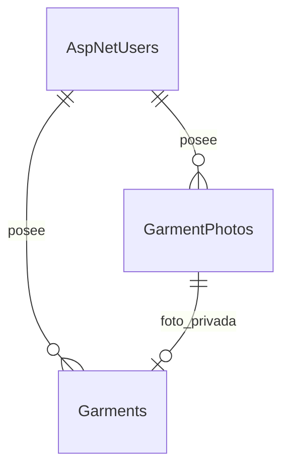

# Alta de prendas con fotografía

Incremento del 6 de octubre de 2026. Implementa alta, listado paginado y detalle; no cierra todo B08 ni el sprint. Continúan pendientes edición, archivo, eliminación, usos, métricas y recuperación de contraseña.

## Flujo

Mi closet → Agregar prenda → cámara o galería → completar datos → Guardar prenda → listado → detalle.

Foto, nombre (100 caracteres), categoría, color (40) y conservación son obligatorios. Marca (100), precio USD y fecha de compra son opcionales. Precio desconocido se conserva como NULL, distinto de cero. Se aceptan hasta dos decimales y se rechazan negativos y fechas futuras según la zona de la cuenta. El nuevo registro es activo.

Categorías: Blusa, Camisa, Pantalón, Jean, Vestido, Chaqueta, Falda, Zapatos y Accesorios. Conservación: Excelente, Bueno y Regular. El color admite texto como multicolor u otro. Los catálogos se validan en Application; su administración desde base no forma parte de este incremento.

Flutter usa image_picker 1.2.4, publicado por flutter.dev: https://pub.dev/packages/image_picker. Recupera fotos pendientes con retrieveLostData si Android destruye la actividad; los demás campos del formulario solo se conservan mientras la pantalla sigue en memoria. No agrega permisos amplios de almacenamiento. iOS sigue fuera del piloto y requerirá su proyecto y textos de permisos.

## Contratos y seguridad

Todas estas rutas requieren JWT y derivan el propietario de sub, nunca del cuerpo.

| Ruta | Entrada y respuesta |
|---|---|
| POST /api/v1/garment-photos | Cuerpo binario JPEG/PNG (application/octet-stream), máximo 8 MiB. 201 {id}. |
| GET /api/v1/garment-photos/{id} | JPEG privado con no-store y nosniff; 404 para foto ajena, ausente o temporal vencida. |
| POST /api/v1/garments | id UUID de solicitud, photoId, name, category, color, brand?, purchasePrice?, purchaseDate? YYYY-MM-DD, condition. 201 DTO con Location. |
| GET /api/v1/garments?page=1 | {items, page, hasMore}, 20 filas; orden CreatedAt e Id descendentes. No incluye bytes de fotos. |
| GET /api/v1/garments/{id} | DTO propio; 404 si no existe o pertenece a otra cuenta. |

La foto debe ser temporal, vigente y propia. La FK compuesta impide vincular fotos ajenas y el índice único impide compartir foto entre prendas. La misma solicitud de alta con idénticos datos devuelve el mismo registro; otros datos con ese id producen 409. Un bloqueo transaccional por cuenta serializa reintentos concurrentes. Flutter conserva el cuerpo de un envío ambiguo y bloquea su edición para reintentarlo con el mismo id. No se reenvía automáticamente tras un timeout.

SkiaSharp 4.153.1 decodifica el contenido real, limita a 24 MP y 8192 píxeles por lado, corrige orientación y recodifica JPEG a un máximo de 1600 píxeles por lado sin metadatos EXIF. Las cabeceras MIME del cliente no se consideran prueba del formato. Se incluyen bibliotecas nativas para Windows y Linux.

## Decisión de persistencia del piloto

Se concreta el almacenamiento privado propuesto en el diseño con PostgreSQL bytea detrás de IGarmentRepository. El cliente solo recibe identificadores y rutas autenticadas. Para este piloto evita añadir otro servicio, permite vincular prenda y foto en una transacción y respalda las fotos junto con la base. Aumenta el tamaño de base y copias; medir antes de ampliar el piloto. La evolución a almacenamiento de objetos requerirá el adaptador y la cola de borrado persistente previstos en el diseño.

Las fotos sin vincular caducan en 24 horas. Un servicio de API elimina las vencidas cada hora y reintenta en el siguiente ciclo si falla. Si la API está detenida no se ejecuta limpieza; al arrancar vuelve a ejecutarse tras una hora. Las fotos vinculadas no caducan. No hay objetos de disco que queden huérfanos. La sustitución y eliminación de fotos vinculadas se implementarán junto con editar/eliminar prendas.

La migración AddGarmentsAndPrivatePhotos crea las dos tablas sin borrar usuarios ni sesiones. deploy/sql/closet.sql contiene el script idempotente completo.

## Actualizar el entorno local

1. Detener Flutter con q y el backend con Ctrl+C, conservando las ventanas con sus variables.
2. Desde la raíz del repositorio, traer la rama feat/base-acceso con git pull --ff-only.
3. Ejecutar dotnet restore backend/TaeStyle.sln.
4. Con ConnectionStrings__Database y Jwt__Key configuradas, ejecutar dotnet tool run dotnet-ef database update --project backend/src/TaeStyle.Infrastructure --startup-project backend/src/TaeStyle.API.
5. Reiniciar backend: dotnet run --project backend/src/TaeStyle.API --no-launch-profile --urls http://127.0.0.1:5080 (Development).
6. Desde mobile/tae_style ejecutar flutter pub get y flutter run -d emulator-5554 --dart-define=API_BASE_URL=http://10.0.2.2:5080. Requiere reinicio completo, no solo hot reload, por el plugin nativo de fotos.
7. Probar alta con foto de galería/cámara, campos opcionales vacíos, detalle y reapertura. En el emulador se puede arrastrar una foto JPEG/PNG al teléfono para disponer de contenido de prueba.

No guardar claves, cadenas de conexión ni fotos personales en Git. No usar migrate fresh ni eliminar la base de datos.

## Verificación

Pruebas backend: alta autenticada, dos cuentas, foto inválida y excesiva, foto ajena, reintento concurrente, conflicto de cuerpo, foto ya vinculada, lectura de foto, precio desconocido, fecha futura y limpieza de temporales. Pruebas Flutter: renovación JWT al subir bytes, red frente a closet vacío, validación previa al envío, además de las pruebas de acceso existentes.

La prueba manual de cámara/galería en el emulador de la usuaria es una comprobación de aceptación pendiente. Este incremento no declara validado un despliegue Docker ni un lanzamiento público.

Resultado local: 9 pruebas .NET aprobadas contra PostgreSQL desechable en puerto 55432; 7 pruebas Flutter aprobadas; 1 prueba Flutter contra API externa omitida por no proporcionar TEST_API_URL; flutter analyze sin observaciones. Consulta NuGet de vulnerabilidades conocidas, incluidas transitivas: ninguna reportada al ejecutar el 6 de octubre. La compilación APK desde el entorno automatizado falló antes de compilar el proyecto, en la conexión interna de Gradle/JDK 25 (Unable to establish loopback connection). No se afirma que el APK actualizado esté validado. No se cambiaron ajustes permanentes de Java ni se instaló sobre el emulador de la usuaria.
